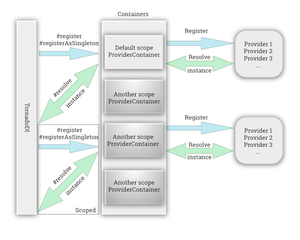

<p align="center">
  
</p>

# TornadoDI :tornado:

> TornadoDI provide a modern lite way to deal with dependency injection into your Typescript or javascript project

[](https://travis-ci.org/adrien2p/tornadodi)
[](https://coveralls.io/github/adrien2p/tornadodi?branch=master)
[](https://github.com/adrien2p/tornadodi/blob/master/LICENSE)
[](https://badge.fury.io/js/tornadodi)

<p align="center">
  
</p>

## Table of Contents 

- [Prerequisites](#prerequisites)
- [Installation](#installation)
- [Features](#features)
  - [Decorators](#decorators)
    - [@Injectable()](#injectable)
    - [@Inject()](#inject)
    - [@Dependencies()](#dependencies)
  - [Registering and resolving](#registering-and-resolving)
    - [registerAsSingleton](#registerAsSingleton)
    - [register](#register)
    - [Resolve a class](#resolve-a-class)
  - [Clear the container](#clear-the-container)
  - [Scoped container](#scoped-container)
- [Team](#team)
- [License](#license)

## Prerequisites

In order to be able to use `TornadoDI` into your project, you will have to install two libraries.

```text
npm i reflect-metadata @types/reflect-metadata
```

If you are working on a javascript project, you have to install few `babel` plugins

```text
npm i --save-dev @babel/cli @babel/core @babel/plugin-proposal-decorators @babel/preset-env
```

and configure your `.babelrc` as the following

```text
{
  "presets": ["@babel/env"],
  "plugins": [
    ["@babel/plugin-proposal-decorators", { "legacy": true }]
  ]
}
```

## Installation

To use `TornadoDI` you have to install the library first.

```text
npm i tornadodi
```

## Features
  
### Decorators

To free the power of `TornadoDI` some decorators are provided in order to rich the purpose of the dependency injection.

#### @Injectable()

The `@Injectable()` decorator is the more important one, it is through this decorator than `TornadoDI` will
be able to know about what as to be injected in the class to resolve.

```typescript
// Typescript
import { Injectable } form 'tornadodi';

@Injetable()
export class Foo { } 
```
```javascript
// Javascript
const Injectable = require('tornadodi').Injectable;

@Injetable()
class Foo { }

module.exports = Foo;
```

#### @Inject()

The `@Inject()` decorator will allow you to specify a token or a class to be inject for a specific constructor decorator.
To specify a token during the registration, refer you to the following section [Register a class](#register-a-class)

```typescript
// Typescript
import { Injectable, Inject } form 'tornadodi';

@Injetable()
export class Foo { 
    constructor(@Inject('barToken') private bar: Bar)
} 
```

###### Take as parameter

Only one parameter.

| Parameter type | Example |
|:---:|:---:|
| `string` | `'fooToken'` |
| `(new (...args: any[]) => any)` | `Foo` |

#### @Dependencies()

In javascript you will not be able to emit `design:paramtypes` metadata from a class. In order to be able to specify the injection
you can use the `@Dependencies()` decorator which will be able to populate this specific metadata and allow `TornadoDI`
to deal with the injection.

```javascript
// Javascript
const Injectable = require('tornadodi').Injectable;
const Dependencies = require('tornadodi').Dependencies;

@Injetable()
@Dependencies('barToken')
export class Foo { 
    constructor(bar)
} 

module.exports = Foo;
```

###### Take as parameter

Any number of parameter.

| Parameter type | Example |
|:---:|:---:|
| `string` | `'fooToken'` |
| `(new (...args: any[]) => any)` | `Foo` |

### Registering and resolving

During the time you are using `TornadoDI` you will be able to register any classes at any time and resolve them
when you want. The resolution is made only when it is asked for and never during the registration for performance
purpose.

#### Register a class

After that you have created your class and used the appropriate decorator (see below), you will be able to register all of them.
Registering a class does not mean that she's resolved as the same time (We will see how the resolution work in the [Resolve dependencies](#resolve-dependencies) section).

To register a new class or multiple classes you have two possibilities.

##### registerAsSingleton

The `registerAsSingleton` method will provide you a way to explicitly register a class that can be instantiated only once in the 
whole container. The singleton will be used as well to instantiate other classes with always the same instance if they inject this singleton.

To use this methods see the following example.

```typescript
// Typescript
import Bar from './bar.service';
import Foo from './foo.service';
import { Tornado } form 'tornadodi';

const bootstrap = () => {
    // Registering the two classes.
    Tornado.registerAsSingleton([Foo, Bar]);
};
bootstrap();
```
```javascript

// Javascript
const Bar = require('./bar.service');
const Foo = require('./foo.service');
const Tornado = require('tornadodi').Tornado

const bootstrap = () => {
    // Registering the two classes.
    Tornado.registerAsSingleton([Foo, Bar]);
};
bootstrap();
```

###### Take as parameter

Only one parameter.

| Parameter type | Example |
|:---:|:---:|
| `{ token: string; metatype: (new (...args: any[]) => any) }` | `{ token: 'MyToken', metatype: Foo }` |
| `(new (...args: any[]) => any)` | `Foo` |
| `Array</* Previous types */>` | `[{ token: 'MyToken', metatype: Foo }, Bar]` |

> Take as parameter an `object` as `{ token: 'MyToken', metatype: Foo }` or `(new (...args: any[]) => any)` corresponding to a class or
a mixed array of the previous specified types

##### register 

Otherwise, the `register` method will provide you the possibility to register a class as a non singleton one. In order words,
each time you will ask to resolve it, you will get a new instance of it and, each time the class is injected, a new instance
will be used.

To use this methods see the following example.

```typescript
// Typescript
import Bar from './bar.service';
import Foo from './foo.service';
import { Tornado } form 'tornadodi';

const bootstrap = () => {
    // Registering the two classes.
    Tornado.register([Foo, Bar]);
};
bootstrap();
```
```javascript
// Javascript
const Bar = require('./bar.service');
const Foo = require('./foo.service');
const Tornado = require('tornadodi').Tornado

const bootstrap = () => {
    // Registering the two classes.
    Tornado.register([Foo, Bar]);
};
bootstrap();
```

###### Take as parameter

Only one parameter.

| Parameter type | Example |
|:---:|:---:|
| `{ token: string; metatype: (new (...args: any[]) => any) }` | `{ token: 'MyToken', metatype: Foo }` |
| `(new (...args: any[]) => any)` | `Foo` |
| `Array</* Previous types */>` | `[{ token: 'MyToken', metatype: Foo }, Bar]` |

#### Resolve a class

After have been registering the different classes, you will be able to resolve them. The resolution of any classes is made
when you call the `resolve` method. That means than the dependency resolution is lazy and apply when it requested.

The resolution will resolve the class and it's dependencies, if they are register as singleton the next resolve will return the 
same instance as the previous one. See the following example.

```typescript
// Typescript
import Bar from './bar.service';
import Foo from './foo.service';
import { Tornado } form 'tornadodi';

const bootstrap = () => {
    Tornado.register([Foo, Bar]);
    // Resolving a dependency.
    const foo = Tornado.resolve<Foo>(Foo);
    const bar = Tornado.resolve<Bar>(Bar);
};
bootstrap();
```
```javascript
// Javascript
const Bar = require('./bar.service');
const Foo = require('./foo.service');
const Tornado = require('tornadodi').Tornado

const bootstrap = () => {
    Tornado.register([Foo, Bar]);
    // Resolving a dependency.
    const foo = Tornado.resolve(Foo);
    const bar = Tornado.resolve(Bar);
};
bootstrap();
```

###### Take as parameter

Only one parameter.

| Parameter type | Example |
|:---:|:---:|
| `string` | `'fooToken'` |
| `(new (...args: any[]) => any)` | `Foo` |

### Clear the container

`TornadoDI` as it's own container, which is not accessible to the user natively. If you want at any time
clear all the dependencies registered into the container, you can call the `clear` method as the following example.

```typescript
// Typescript
import Bar from './bar.service';
import Foo from './foo.service';
import { Tornado } form 'tornadodi';

const bootstrap = () => {
    Tornado.register([{ token: 'foo', metatype: Foo }, Bar]);
    const foo = Tornado.resolve<Foo>('foo');
    const bar = Tornado.resolve<Bar>(Bar);
    console.log(Tornado.getContainerSize()); // result: 2;
    
    // Reset container
    Tornado.clear();
    console.log(Tornado.getContainerSize()); // result: 0;
};
bootstrap();
```
```javascript
// Javascript
const Bar = require('./bar.service');
const Foo = require('./foo.service');
const Tornado = require('tornadodi').Tornado

const bootstrap = () => {
    Tornado.register([{ token: 'foo', metatype: Foo }, Bar]);
    const foo = Tornado.resolve('foo');
    const bar = Tornado.resolve(Bar);
    console.log(Tornado.getContainerSize()); // result: 2;
    
    // Reset container
    Tornado.clear();
    console.log(Tornado.getContainerSize()); // result: 0;
};
bootstrap();
```

### Scoped container

In `TornadoDI` you are able to switch container at any time to work with.
in every features that we have seen previously in [Features](#registering-and-resolving) from `registering and resolving` section.
You are able to specify as a second argument, the `scope` that you want to target. It will switch automatically on this
scoped container to process the action. If there is no specified scope, the default container will be used.
See the following example.

```typescript
// Typescript
Tornado.registerAsSingleton([{ token: 'foo', metatype: Foo }, Bar], 'scoped');
Tornado.register([{ token: 'foo', metatype: Foo }, Bar], 'scoped');
Tornado.resolve<Bar>(Bar, 'scoped')
```
```javascript
// Javascript
Tornado.registerAsSingleton([{ token: 'foo', metatype: Foo }, Bar], 'scoped');
Tornado.register([{ token: 'foo', metatype: Foo }, Bar], 'scoped');
Tornado.resolve(Bar, 'scoped')
```

## Team
- Adrien de Peretti

## License
This project is licensed under the MIT License - see the LICENSE.md file for details